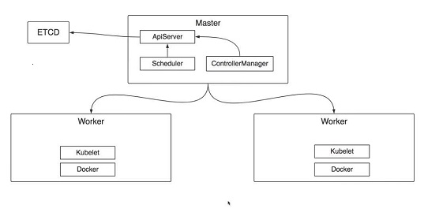
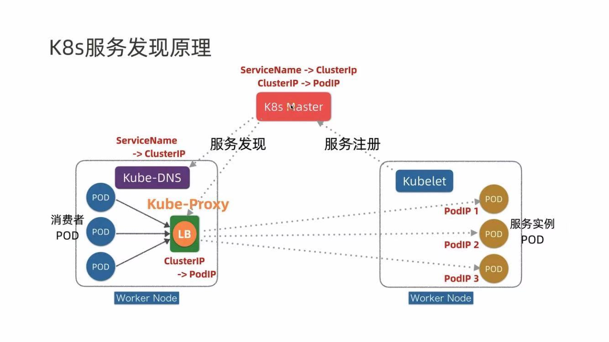
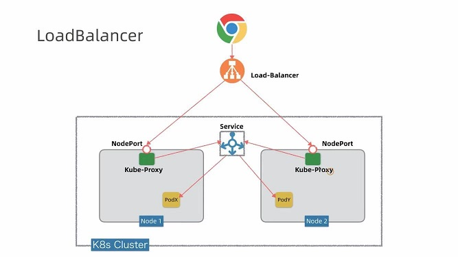

## K8s is an open-source system for automating deployment, scaling, and management of containerized applications.
## Basic objects include:

* Pod. A group of one or more containers.
* Service. An abstraction that defines a logical set of pods as well as the policy for accessing them.
* Volume. An abstraction that lets us persist data. (This is necessary because containers are ephemeral—meaning data is deleted when the container is deleted.)
* Namespace. A segment of the cluster dedicated to a certain purpose, for example a certain project or team of devs.

## Controllers, or higher-level abstractions, include:

* ReplicaSet (RS). Ensures the desired amount of pod is what’s running.
* Deployment. Offers declarative updates for pods an RS.
* StatefulSet. A workload API object that manages stateful applications, such as databases.
* DaemonSet. Ensures that all or some worker nodes run a copy of a pod. This is useful for daemon applications like Fluentd.
* Job. Creates one or more pods, runs a certain task(s) to completion, then deletes the pod(s).

---

---

